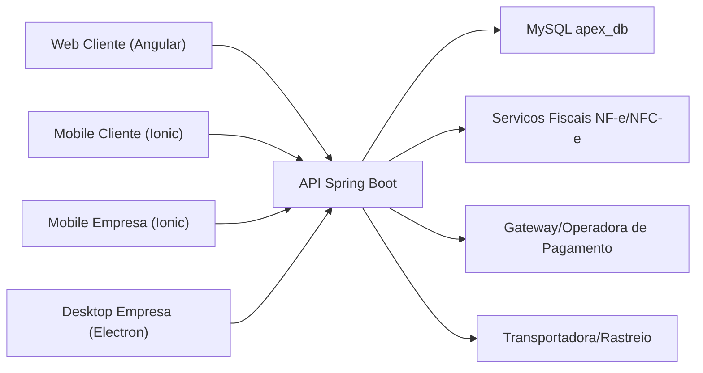
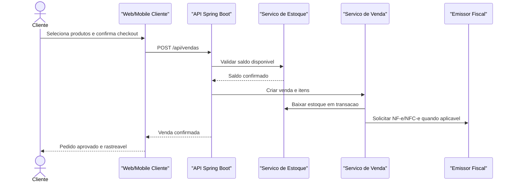
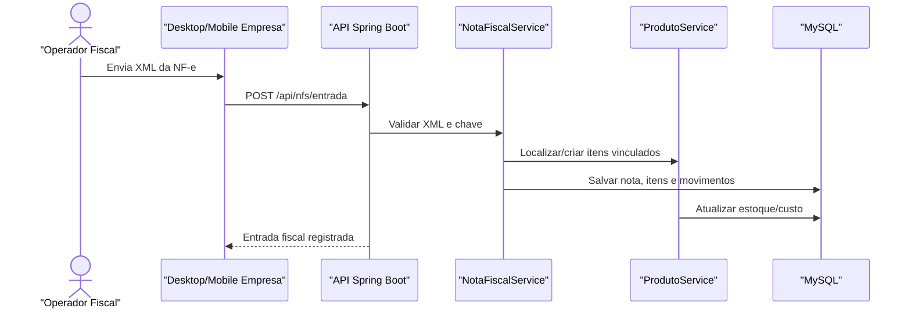
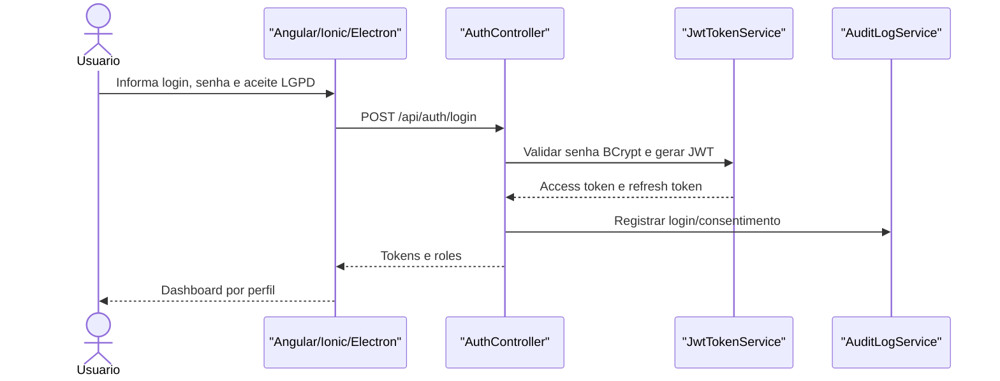
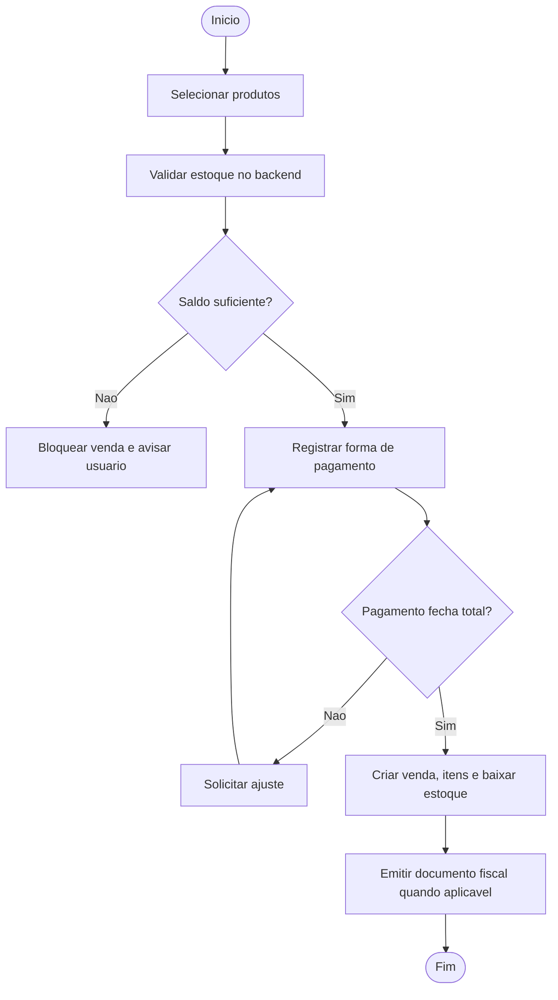
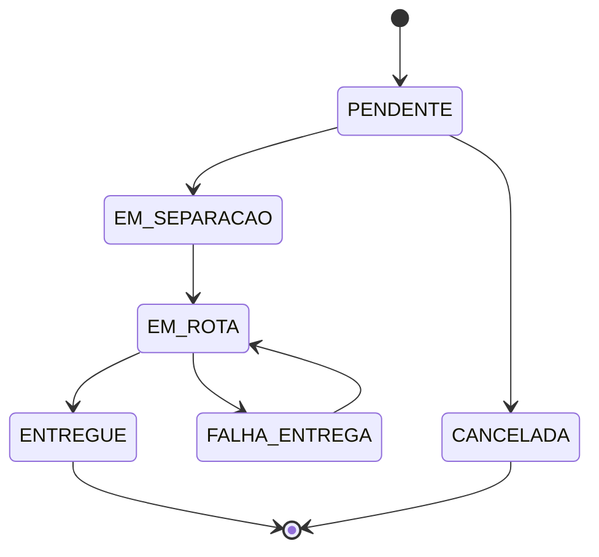
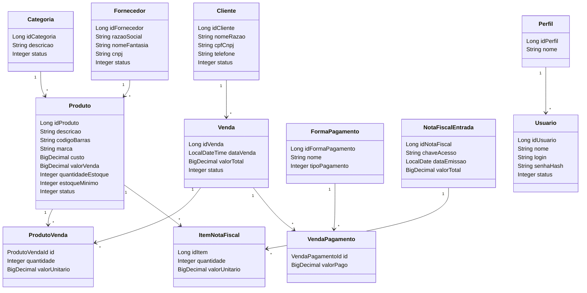
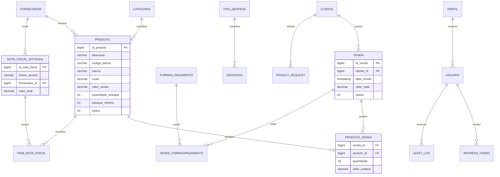

# Apex Gestor 3.0 - Documentacao do Sistema

## 1. Visao Geral

O Apex Gestor 3.0 e um ecossistema hibrido de ERP, PDV e e-commerce. A versao 2.0 nasceu como uma solucao voltada a um nicho especifico de comercio, mas a versao 3.0 generaliza as regras de negocio para atender qualquer empresa de venda de produtos: varejo geral, eletronicos, vestuario, material de construcao, cosmeticos, mercado, autopecas e operacoes B2B/B2C.

A mudanca central de arquitetura e tratar o segmento da empresa como configuracao, nao como regra fixa de codigo. Produto, categoria, fornecedor, cliente, pagamento, nota fiscal, despesa, venda, pedido e entrega formam um nucleo comercial reutilizavel por diferentes nichos.

## 2. Plataformas do Ecossistema

| Plataforma | Tecnologia | Publico | Objetivo |
| --- | --- | --- | --- |
| Web Cliente | Angular + Ionic | Consumidor final | Loja online B2C com busca, filtros, carrinho e checkout. |
| Mobile Cliente | Ionic + Capacitor Android | Consumidor final | Compra recorrente, notificacoes, ofertas e rastreio. |
| Mobile Empresa | Ionic + Capacitor Android | Vendedor, gerente e equipe operacional | Estoque, vendas rapidas, metricas e conferencia em movimento. |
| Desktop Empresa | Electron + Angular/Ionic | Caixa, gerente e administrativo | PDV, operacao local, hardware e rotinas administrativas densas. |
| Backend | Spring Boot + MySQL | Todas as plataformas | API REST, seguranca, RBAC, estoque, venda, financeiro, LGPD e licenciamento. |

## 3. Arquitetura de Alto Nivel

## 4. Regras de Negocio Multi-Nicho

O sistema suporta diferentes segmentos porque as regras dependem de atributos comerciais genericos:

- Produto: descricao, codigo de barras, marca, unidade, custo, preco, estoque minimo, categoria e fornecedor.
- Categoria: organiza catalogos de qualquer nicho.
- Fornecedor: abastece produtos via compra e entrada fiscal.
- Cliente: representa consumidor final, cliente de balcao ou empresa compradora.
- Usuario e Perfil: controlam acesso interno por RBAC.
- Venda: consolida PDV, e-commerce e mobile.
- ProdutoVenda: preserva quantidade, preco e custo no momento da venda.
- FormaPagamento e VendaPagamento: permitem multiplos meios de pagamento.
- NotaFiscalEntrada e ItemNotaFiscal: registram entrada de mercadorias por XML.
- Despesa e TipoDespesa: sustentam fluxo de caixa e DRE basico.
- Auditoria, consentimento, privacidade e licenca: sustentam seguranca, LGPD e propriedade intelectual.

Exemplos de adaptacao por segmento:

| Segmento | Configuracao principal | Sem alterar codigo |
| --- | --- | --- |
| Eletronicos | SKU, codigo de barras, marca, garantia, voltagem como variacao futura | Categorias e atributos comerciais. |
| Vestuario | Tamanho, cor, colecao e grade como variacao futura | ProdutoVariacao no roadmap. |
| Material de construcao | Unidade de medida, estoque minimo, fornecedor e custo medio | Campos atuais de produto/fornecedor. |
| Mercado | Giro alto, estoque minimo e multiplas formas de pagamento | Produto, estoque e caixa. |
| B2B/Atacado | Cliente PJ, pedido maior, condicoes de pagamento | Cliente, venda e pagamento. |

## 5. Atores

- Cliente: navega na loja, adiciona itens ao carrinho, finaliza pedido, acompanha entrega e exerce direitos LGPD.
- Vendedor: opera PDV, consulta estoque, cria vendas e atende clientes.
- Gerente: acompanha indicadores, lucro, despesas, performance de equipe e estoque baixo.
- Administrador: gerencia usuarios, perfis, menus, API, licenca e parametros do sistema.
- Estoquista/Operador Fiscal: importa XML de NF-e, confere itens e acompanha entrada de mercadorias.
- Sistema Externo: gateways de pagamento, emissor fiscal, transportadora e servico de licenciamento.

## 6. Diagrama de Casos de Uso Geral

```mermaid
flowchart TB
  cliente["Cliente"] --> ucComprar["Comprar no e-commerce"]
  cliente --> ucCarrinho["Gerenciar carrinho"]
  cliente --> ucEntrega["Acompanhar entrega"]
  cliente --> ucPrivacidade["Solicitar exportacao/exclusao LGPD"]

  vendedor["Vendedor"] --> ucPDV["Finalizar venda no PDV"]
  vendedor --> ucClientes["Consultar/cadastrar cliente"]
  vendedor --> ucEstoque["Consultar estoque"]

  gerente["Gerente"] --> ucRelatorios["Analisar relatorios"]
  gerente --> ucFinanceiro["Controlar despesas e caixa"]
  gerente --> ucEquipe["Acompanhar equipe"]

  admin["Administrador"] --> ucUsuarios["Gerenciar usuarios e perfis"]
  admin --> ucConfig["Configurar API e licenca"]
  admin --> ucCatalogo["Gerenciar catalogo"]

  fiscal["Operador fiscal"] --> ucXml["Importar XML de NF-e"]
  fiscal --> ucNfe["Emitir NF-e/NFC-e"]

  ucComprar --> api["API Apex Gestor"]
  ucPDV --> api
  ucXml --> api
  ucRelatorios --> api
```

## 7. Casos de Uso Especificos

### UC-01 - Gerenciar Catalogo Multi-Nicho

- Atores: Administrador, Gerente.
- Entrada: descricao, categoria, fornecedor, codigo de barras, marca, custo, preco, estoque minimo e status.
- Fluxo principal: cadastrar produto, vincular categoria/fornecedor, publicar para venda e atualizar preco/estoque.
- Regras: produto inativo nao aparece na loja; produto com estoque abaixo do minimo aparece em alerta; cada nicho usa categorias e atributos proprios.
- Endpoints atuais: `/api/produtos`, `/api/categorias`, `/api/fornecedores`.

### UC-02 - Comprar no E-commerce

- Atores: Cliente.
- Entrada: busca, filtros, carrinho, endereco e forma de pagamento.
- Fluxo principal: cliente pesquisa produto, adiciona ao carrinho, confirma checkout, backend cria venda/pedido, estoque e abatido/reservado e entrega e iniciada.
- Regras: estoque deve ser validado no backend; preco e custo devem ser gravados como snapshot no item da venda.
- Telas atuais: `/store`, `/cart`, `/checkout`.

### UC-03 - Finalizar Venda no PDV

- Atores: Vendedor, Gerente.
- Entrada: produtos, quantidades, desconto, cliente e formas de pagamento.
- Fluxo principal: operador seleciona itens, aplica desconto permitido, informa pagamento, API valida estoque, baixa saldo e registra venda.
- Regras: venda nao finaliza com estoque insuficiente; cancelamento deve estornar estoque; pagamentos devem fechar o total.
- Endpoint atual: `/api/vendas`.

### UC-04 - Importar XML de NF-e

- Atores: Operador fiscal, Gerente.
- Entrada: arquivo XML NF-e.
- Fluxo principal: usuario importa XML, sistema valida fornecedor e itens, registra NotaFiscalEntrada, cria ItemNotaFiscal e incrementa estoque.
- Regras: chave da NF-e deve ser idempotente; entrada deve ocorrer em transacao; divergencias devem ir para conferencia.
- Endpoint atual: `/api/nfs/entrada`.

### UC-05 - Controlar Financeiro

- Atores: Gerente, Administrador.
- Entrada: despesas, tipos de despesa, vendas e pagamentos.
- Fluxo principal: registrar despesas, consultar relatorio financeiro, acompanhar lucro liquido, CMV e saldo de caixa.
- Regras: despesas canceladas nao entram no total; relatorio deve considerar periodo e status.
- Endpoints atuais: `/api/despesas`, `/api/despesas/tipos`, `/api/relatorios/financeiro`.

### UC-06 - Gerenciar Acesso, LGPD e Licenca

- Atores: Administrador, Cliente, Usuario interno.
- Entrada: login, senha, aceite de politica, solicitacao LGPD, chave de licenca, app contratado e fingerprint do dispositivo.
- Fluxo principal: autenticar via JWT, registrar consentimento, validar licenca por pacote de apps, auditar operacoes sensiveis e processar exportacao/exclusao.
- Regras: BCrypt para senha; refresh token rotativo; rotas protegidas por RBAC; dados sensiveis mascarados em suporte/logs.
- Endpoints atuais: `/api/auth/**`, `/api/privacy/**`, `/api/licenses/validate`; as demais rotas `/api/**` exigem headers de licenca ativa.

## 8. Diagramas de Sequencia

### 8.1 Checkout Omnichannel

### 8.2 Entrada de XML NF-e

### 8.3 Login Seguro

## 9. Diagramas de Atividade

### 9.1 Venda com Baixa de Estoque

### 9.2 Entrega Simplificada

## 10. Diagrama de Classes

## 11. Modelo Logico de Banco de Dados

## 12. Requisitos Nao Funcionais

- Segurança: JWT, BCrypt, RBAC, CORS restrito por origem, auditoria e CSP.
- LGPD: consentimento versionado, exportacao, exclusao/anonimizacao e pseudonimizacao de logs.
- Performance: build Angular otimizado, lazy loading, cache de consultas e batching JPA.
- Acessibilidade: contraste WCAG 2.1 AA/AAA, foco visivel e areas de toque de pelo menos 44 px.
- Multiplataforma: web, desktop Electron e Android por Capacitor.
- Integridade: manifesto SHA-256 no build seguro e Electron com `contextIsolation`, `sandbox` e `nodeIntegration=false`.

## 13. DevOps e Releases

O pipeline 3.0 deve gerar quatro artefatos:

- `apex-gestor-web-cliente-<versao>.zip`
- `Apex Gestor Setup <versao>.exe` ou instalador equivalente do Electron Builder
- `apex-gestor-mobile-empresa-<versao>.apk`
- `apex-gestor-mobile-cliente-<versao>.apk`

Em pushes para `main`, os arquivos ficam disponiveis como artifacts da Action. Em tags `v*`, os mesmos arquivos sao publicados automaticamente em GitHub Releases.

## 14. Roadmap Tecnico Pos-3.0

- Criar entidade `ProdutoVariacao` para tamanho, cor, voltagem, lote e grade.
- Criar `MovimentoEstoque` para rastrear entrada, saida, reserva, ajuste e estorno.
- Criar `Pedido` separado de `Venda` para ciclo e-commerce completo antes do faturamento.
- Criar `Entrega` com status, transportadora, rastreio e historico.
- Adicionar Testcontainers MySQL para testes de integracao.
- Adicionar Cypress para fluxos `NF -> estoque -> PDV -> baixa`.
- Assinar APK release e instaladores desktop com certificados reais.
