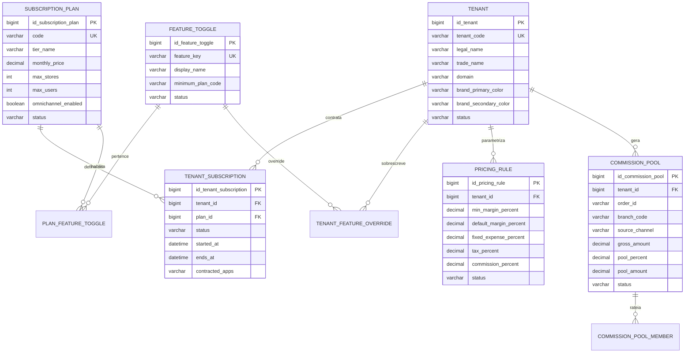

# Apex Gestor v4.0 - SaaS Multi-Tier e Feature Toggling

## Objetivo

O Apex Gestor passa a operar como SaaS multi-tenant com tres planos comerciais:

- `ESSENTIAL`: ERP, PDV, financeiro essencial e precificacao base.
- `GROWTH`: adiciona financeiro avancado, white-label B2C e comissionamento omnichannel.
- `PREMIUM`: adiciona operacao multi-loja, roteamento logistico, reserva temporaria de estoque e relatorios hierarquicos.

O codigo e unico para todos os clientes. Upgrade e downgrade mudam apenas registros de `tenant_subscription`, `plan_feature_toggle` ou `tenant_feature_override`.

## Modelo Entidade-Relacionamento



## Backend Spring Boot

Principais endpoints:

- `POST /api/licenses/validate`: valida licenca, app, dispositivo e retorna `tenantCode`, `subscriptionTier`, `features` e `branding`.
- `GET /api/tenants/current/features`: retorna o contexto de feature flags do tenant autenticado.
- `GET /api/tenants/feature-catalog`: lista o catalogo de features para administradores/auditores.
- `POST /api/financeiro/precificacao`: calcula preco sugerido e cria `commission_pool` quando a venda online exige pool de comissao.

Exemplo real de guarda de feature:

```java
boolean commissionRequested = sellerCommissionPercent.compareTo(BigDecimal.ZERO) > 0 || request.onlineSale();
if (commissionRequested) {
    tenantFeatureService.requireFeature(tenantCode, TenantFeatureKey.COMMISSION_OMNICHANNEL);
}
```

Esse bloqueio esta implementado em `Service.PricingService`. Se o tenant estiver no plano `ESSENTIAL`, a API responde com `402 Payment Required` antes de executar a regra complexa.

## Frontend Angular/Ionic/Electron

O arquivo `src/app/core/feature-menu.config.ts` define o menu modular:

```ts
{ label: 'Financeiro Pro', path: '/finance', requiredFeatures: ['ADVANCED_FINANCE'] }
{ label: 'Comissoes Omnichannel', path: '/finance', requiredFeatures: ['COMMISSION_OMNICHANNEL'] }
{ label: 'Roteamento Multi-Loja', path: '/invoice-entry', requiredFeatures: ['MULTI_STORE_ROUTING'] }
```

O `TenantFeatureService` le o status da licenca, aplica white-label apenas nos frontends B2C (`web-client` e `mobile-client`) e expoe `hasAll()` para o `AppComponent` ocultar itens premium no menu.

## Bootstrap e Gerenciadores

- Bootstrap foi adicionado como dependencia frontend fixa em `bootstrap@5.3.8`.
- O CSS global importa `bootstrap/dist/css/bootstrap.min.css`.
- Backend permanece Maven-first com `mvnw`.
- Gradle permanece apenas no projeto Android gerado pelo Capacitor, onde e requisito nativo da plataforma.
- O monorepo continua trunk-based: `main` para producao, `staging` para homologacao e `develop` para integracao continua.
